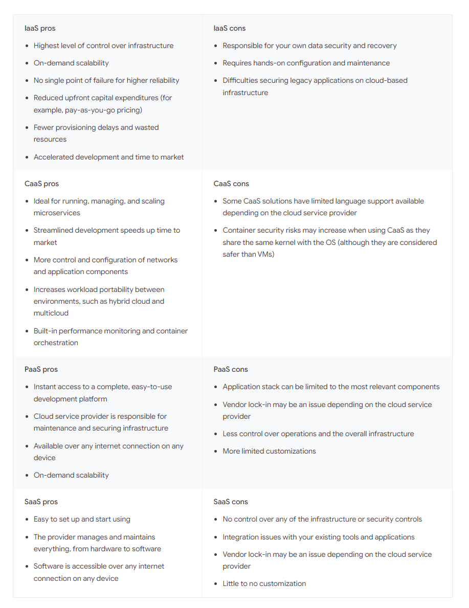

https://landscape.cncf.io/?fullscreen=yes

# IaaS SaaS PaaS 

# Ingress vs API Gateway

# Load Balancers
A load balancer serves as the single point of contact for clients. 

Clients send requests to the load balancer, and the load balancer sends them to targets (such as EC2 instances)

AWS - to configure the load balancer, create target groups, and then register targets with the target groups. 

You also create listeners to check for connection requests from clients, and listener rules to route requests from clients to the targets in one or more target groups.

A listener is a process that checks for connection requests, using the protocol and port that you configure. 

## Load Balancer Types

### Network Load Balancer / Layer 4 (L4) Load Balancer — 
The Network Load Balancer functions at Layer 4, specifically handling TCP traffic. 

It distributes traffic at the transport level, making routing decisions based on network variables such as IP addresses and destination ports. 

This load balancer focuses solely on network layer information when directing traffic.

### ALB - Application Load Balancer / Layer 7 (L7) Load Balancer — 
Operating at Layer 7 of the OSI model, the Application Load Balancer distributes the load based on parameters at the application level. 

This load balancer enhances the security and simplifies the application by always ensuring the use of the latest SSL/TLS ciphers and protocols.

# Health Checks

# Reverse Proxy
Reverse proxies function at Layer 7 (application layer) of the OSI model, where they manage requests and responses at the HTTP level.

A reverse proxy functions as a mediator between clients and servers. 

Clients interact solely with the reverse proxy to reach backend servers, as the proxy forwards requests to the relevant server. 

This mechanism conceals the implementation specifics of individual servers within the internal network. 

As shown below, a reverse proxy sits in front of an origin server and ensures that no client ever communicates directly with that origin server.

A reverse proxy is frequently employed for:
* Load distribution via Load balancing.
* Caching — For repeated requests, it can independently respond, either in part or in full. Frequently accessed content is stored in the proxy cache, reducing the need to fetch data from the backend and providing clients with quicker responses.
* Security measures — It provides the option to implement control systems like antivirus or packet filters. These systems, situated between the Internet and the private network, offer added protection for the backends.
* SSL termination — It can be set up to decrypt incoming requests and encrypt outgoing responses, thereby freeing up valuable backend resources.

# API Gateway
Consider the Gateway API as an expanded version of a Reverse Proxy. 

The API Gateway not only forwards requests but also conceals from clients the backend partitioning in the architecture. 

It goes beyond simple request forwarding, potentially engaging in orchestration or aggregation. 

This simplifies client code and reduces the number of API requests/roundtrips. 

Additionally, instead of interacting with multiple backends, clients communicate solely with the API gateway. 

Another aspect involves Protocol Translation, where the API Gateway can convert protocols (e.g., XML to JSON, gRPC to JSON) to facilitate client-server integration. 

The API Gateway serves as a pivotal tool in addressing various essential capabilities such as security, reliability, scalability, observability, and traceability.

# When to use which, LB vs RP vs APIG

* Load Balancers excel in distributing network traffic to enhance availability, scalability, and even load distribution across multiple servers, commonly applied in web applications and services.
* API Gateways focus on the management, security, and optimization of APIs within microservices architectures. Their pivotal role involves exposing, securing, and controlling access to APIs.
* Reverse Proxies find application in security, performance optimization, and load balancing. They are frequently utilized in web servers, caching solutions, and as integral components of application delivery networks.

# gRPC vs REST

# DBs
## REDIS vs RDBMS

Redis is a key-value store, where data is stored as pairs of keys and values.
 
This simplicity makes it efficient for certain use cases like caching, session storage, and real-time analytics. 

* Performance
Redis is renowned for its exceptional performance, especially for read-heavy workloads and scenarios requiring low-latency responses being that it is an in-memory database

* Persistence
One key consideration is data persistence. Redis, being an in-memory store, may not be the best choice for scenarios where durability and persistence are critical. 

While Redis does offer persistence options, such as snapshots and append-only files, RDBMS inherently provides more robust durability features.

* Scalability
Redis excels in horizontal scalability, making it suitable for distributed setups and scenarios where you need to scale out across multiple nodes. 

RDBMS, is also scalable, but might require more effort and careful planning.

### Use Case Considerations
Here are the top three use cases of each database:

* Redis Use Cases:
    * Caching: Redis excels in caching due to its fast read access.
    * Real-time Analytics: Its in-memory nature is beneficial for quick data analysis.
    * Session Storage: Ideal for storing and managing session data. Server backed sessions (where the browser is given a random cookie value which is then associated with a larger chunk of serialized data on the server) are a very poor fit for relational databases.
* MySQL Use Cases:
    * Transactional Data: MySQL is well-suited for applications requiring ACID compliance.
    * Complex Queries: If your application involves complex queries and reporting, MySQL might be a better fit.
    * Data Integrity: For scenarios where relational data integrity is a priority.

# Imperative vs Declaritive
Re: deployments the imperative method is easy to use for ad-hoc operations, while the declarative approach promotes infrastructure-as-code and is better suited for production systems. 
