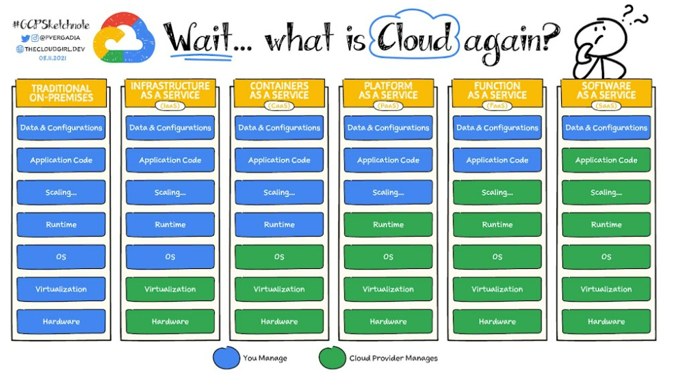

https://landscape.cncf.io/?fullscreen=yes

# IaaS SaaS PaaS 

# Ingress vs API Gateway

# gRPC vs REST

# DBs
## REDIS vs RDBMS

Redis is a key-value store, where data is stored as pairs of keys and values.
 
This simplicity makes it efficient for certain use cases like caching, session storage, and real-time analytics. 

* Performance
Redis is renowned for its exceptional performance, especially for read-heavy workloads and scenarios requiring low-latency responses being that it is an in-memory database

* Persistence
One key consideration is data persistence. Redis, being an in-memory store, may not be the best choice for scenarios where durability and persistence are critical. 

While Redis does offer persistence options, such as snapshots and append-only files, RDBMS inherently provides more robust durability features.

* Scalability
Redis excels in horizontal scalability, making it suitable for distributed setups and scenarios where you need to scale out across multiple nodes. 

RDBMS, is also scalable, but might require more effort and careful planning.

### Use Case Considerations
Here are the top three use cases of each database:

* Redis Use Cases:
    * Caching: Redis excels in caching due to its fast read access.
    * Real-time Analytics: Its in-memory nature is beneficial for quick data analysis.
    * Session Storage: Ideal for storing and managing session data. Server backed sessions (where the browser is given a random cookie value which is then associated with a larger chunk of serialized data on the server) are a very poor fit for relational databases.
* MySQL Use Cases:
    * Transactional Data: MySQL is well-suited for applications requiring ACID compliance.
    * Complex Queries: If your application involves complex queries and reporting, MySQL might be a better fit.
    * Data Integrity: For scenarios where relational data integrity is a priority.

# Imperative vs Declaritive
Re: deployments the imperative method is easy to use for ad-hoc operations, while the declarative approach promotes infrastructure-as-code and is better suited for production systems. 
