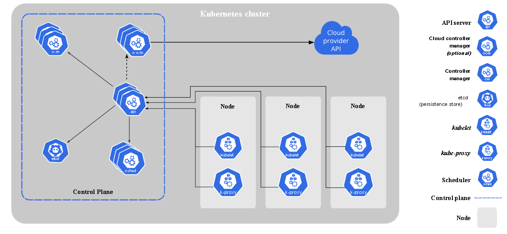

# K8s Architecture and Basic Terminology Explained

## Pod: 
A unit of work. Smallest and simplest Kubernetes objects. 

Typically, a pod is set up to run a single container.

A way to describe a series of containers, the volumes they might share, and interconnections that those containers within the pod may need. 

Gives ability to migrate an application live from one version to another version without having downtime

## Node/ Worker Node: 
A node is a worker machine that performs the requested tasks assigned by the control plane/master node.

### Components
Run on each node, where they maintain running pods and provide the Kubernetes runtime environment.
* Kubelet -  an agent necessary to run the pod, 
* Kube-proxy - maintaining the network rules and allowing communication, 
* Container runtime -  software to run containers. Kubernetes supports various container runtimes like Containerd, CRI-O, Docker, or any Kubernetes Container Runtime Interface (CRI) implementation.

## Main Node / Control plane: 
Control plane components make decisions about the cluster, like scheduling, detecting, and responding to cluster events, such as starting a new pod when a deployment’s replicas field is not the same as mentioned in the desired state. 

### Components
* Kube-apiserver - to expose Kubernetes API, 
* Etcd - a key-value data storage, This component is a highly available and consistent key-value store. Etcd acts as the backing store for all Kubernetes cluster data.
* Kube-scheduler - to watch over unassigned pods and assign them to a node based on the desired state.
* Kube-controller-manager - containing all the controller functions of the control plane; the controller process, including node controllers, endpoints controllers, replication controllers, service accounts, and token controllers.
* Cloud-controller-manager -  The manager links your cluster into your cloud provider's API. It separates the components that interact with the chosen cloud platform from the components that only interact with your cluster.

## Cluster: 
A group of worker nodes that run containerized applications. Every cluster has at least one worker node.

## Kubectl: 
Command line tool for communicating with a Kubernetes cluster’s control plane via the Kubernetes API.

## Kubelet: 
An agent that runs on each node in the cluster, ensuring containers run in a Pod.

## Kubeproxy: 
A network proxy that runs on each node in your cluster and implements the Kubernetes Service concept.

This proxy maintains network rules on nodes. 

These rules allow network communication from sessions inside or outside of your cluster to your pods.

## CoreDNS: 
DNS server that can be used as the Kubernetes cluster DNS.

## API server (Kube-API server): 
The Kubernetes API is accessible through the API server, which is a part of the Kubernetes control plane. 

The API server is the Kubernetes control plane’s front end.

## Secrets: 
Kubernetes object with sensitive data stored such as a password, a token, or a key. 

Use secrets to not write sensitive information into your application code.

## Controller: 
Controllers are control loops that keep watch on the state of your cluster and make or ask for changes as needed. 

Each controller tries to bring the current state of the cluster closer to the desired state.

## Operator: 
This allows you to encapsulate domain-specific knowledge for an application. 

By automating tasks specific to an application, Operators make it easier to deploy and manage apps on K8s.

# How Does Kubernetes Work
* Kubernetes cluster infrastructure consists of the main node/control plane and worker node. 
* Each of these worker nodes contains pods, the smallest Kubernetes unit with a minimum of one container each. 
* The main node/control plane takes instructions and decides tasks for the worker nodes automatically.

 
Source: kubernetes.io

For example, when the developer sends the instructions to the control plane, the API server, the only way to interact with the cluster, takes in the instructions (desired state) in YAML or JSON format and performs authentication before moving it onto the stack.

The control-manager takes it up and sees that the actual state equals the desired state. So, for example, if the desired state has 5 running pods and the actual state has only 3 pods running. Then, it plans to start 2 pods and tells the scheduler to do that.

The scheduler tries to optimize and pack things into the servers utilizing every last piece of resource you have without any waste and assigning new pods to the nodes.

Meanwhile, the etcd stores all the cluster states as a key-value store. Distributing the state to all the other control planes is a distributed data store.

The kubelet then takes it up and runs the cluster. It updates information with the cluster with the state of the node it’s on. It also starts and stops the container as directed by the scheduler.

The Kube-proxy exposes services for the outside world to interact with the cluster and routes network traffic to the proper resource on the node.

## Reference:

## Namespaces: 
Your working area
It's like a project in GCP or a similar thing in AWS.

## Deployment:
Provides a means of changing or modifying the state of a pod, which may be one or more containers that are running, or a group of duplicate pods, known as ReplicaSets
* Deployment use cases include:
    * Running multiple instances of an application
    * Scaling the number of instances of an application up or down
    * Updating every running instance of an application
    * Rolling back all running instances of an application to another version
* Deployments define how applications will run they do not guarantee where applications will live within the cluster. 
    * Applications that require an instance of a pod on every node, use a DaemonSet. 
    * For stateful applications, a StatefulSet will provide unique network identifiers, persistent storage, and ordered deployment/scaling.

## Service: 
Like a load balancer for pods. Knows which pods are alive, healthy, and ready to respond so that when we try to access whatever pod we want to get to instead of to connect to the deployment and getting the one we get, and then always asking that pod for work.

* When using a Kubernetes service, each pod is assigned an IP address. As this address may not be directly knowable, the service provides accessibility, then automatically connects the correct pod, as the example below shows.

* When a service is created it publishes its own virtual address as either an environment variable to every pod or, if the cluster is using coredns, as a dns entry any pod can attempt to reach.

* Services are not just for pods. Services can abstract access to DBs, external hosts, or even other services. 
    * In some of these cases you may need an Endpoint object, but for internal communication this is not required.

## Deployments and Services are often used in tandem
Deployments define the desired state of the application.

Services to make sure communication between almost any kind of resource and the rest of the cluster is stable and adaptable. 

reference:
https://www.copado.com/devops-hub/blog/kubernetes-deployment-vs-service-managing-your-pods

## Ingress: 
This works with the service to make sure everything ends up in the right place. Ingress can also provide load balancing.

## ConfigMaps: 
This is an API object for storing information in key-value pairs. For doing things like pre-stashing environment variables or files that can actually be mounted directly into pods without actually having to have an actual file system somewhere. Not meant for confidential data.

## Reference
https://about.gitlab.com/blog/2020/07/30/kubernetes-terminology/

## Addons
Some of the addons that use Kubernetes resources to initiate cluster features.

* Cluster DNS. Cluster DNS serves DNS records for Kubernetes services. Kubernetes clusters should have a DNS because many examples depend on it.
* Web UI. The Web UI is a general-purpose dashboard for Kubernetes clusters. It lets users manage and troubleshoot the cluster plus any applications running in it.
* Container Resource Monitoring. This addon records generic time-series metrics regarding the central database’s containers and provides a UI for browsing the data.
* Cluster-Level Logging. This mechanism saves container logs to a central log store with a searching and browsing interface.

## Reference:
https://www.simplilearn.com/tutorials/kubernetes-tutorial/kubernetes-cheat-sheet